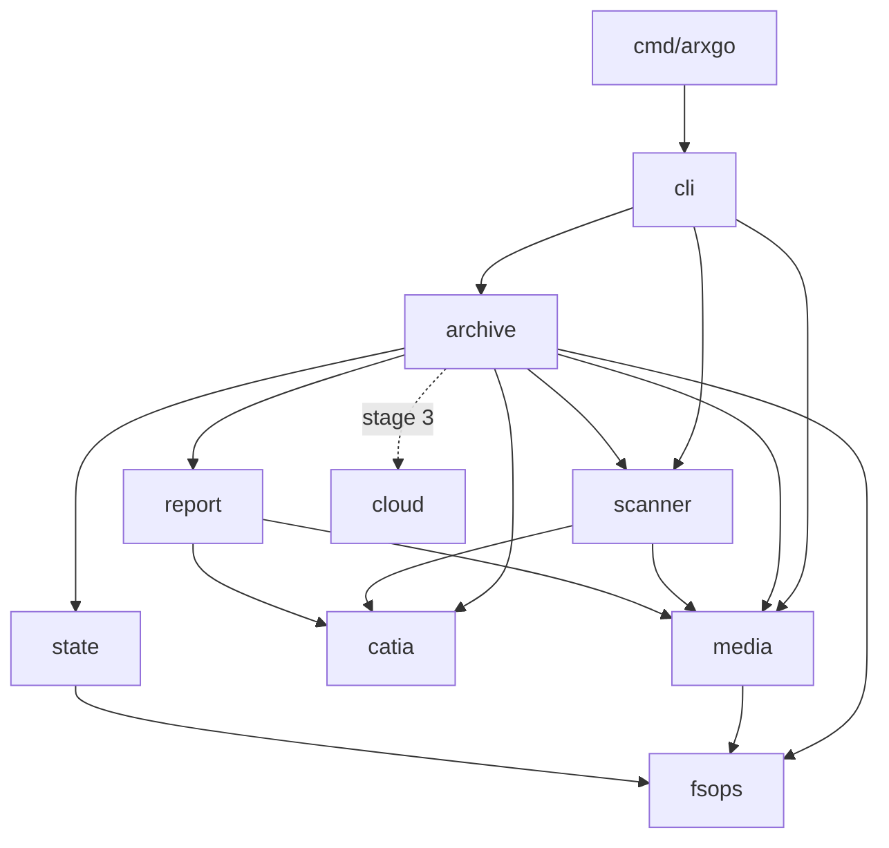
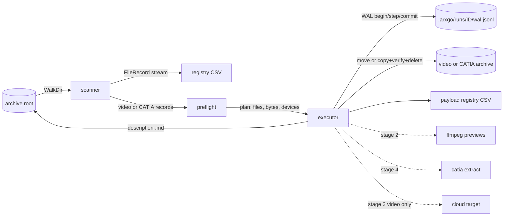
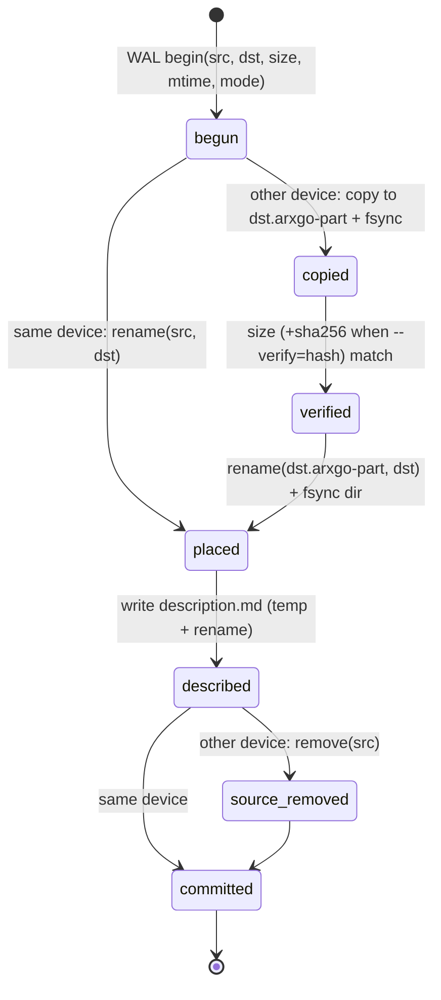

# Architecture

This page describes how the [specification](spec.md) maps onto packages, data flow and the
transaction design. Behavior details live in the stage pages; this page owns module boundaries.

## Repository layout

```text
arxiv-go/
|-- cmd/arxgo/main.go            entry point: os.Exit(cli.Run(...)); nothing else
|-- internal/
|   |-- cli/                     flag parsing, validation, exit codes, logger setup, op dispatch
|   |-- scanner/                 walker.go, order.go, entry.go, relpath.go (traversal, reserved and local paths); mimetype.go (detection and flags)
|   |-- media/                   tools.go, guidance.go (discovery); metadata.go, isobmff*.go, ffprobe.go (metadata); ffmpeg*.go (runner); preview.go, preview_plan.go, samples*.go, frames.go (previews)
|   |-- catia/                   stage 4: kind table, format detection, V5 properties and components, 3dxml, strings (pure Go)
|   |-- fsops/                   device/space syscalls, durable copy/rename, atomic write
|   |-- state/                   rundir.go, lock*.go, checkpoint.go, committed.go, scanstats.go, report.go, runlog.go, wal.go, wal_read.go, wal_event.go (post-commit sidecar event families), recovery.go
|   |-- archive/                 session*.go, resume*.go, finish.go, progress.go, preflight*.go, scan*.go, candidates.go; payload.go (payload kind, spec and hooks), payload_video.go; history.go (WAL of every run of a payload), transfer.go (placement shared by split and restore); split.go, split_exec.go, split_recovery.go, split_description.go, split_report.go; restore.go, restore_exec.go, restore_recovery.go, restore_dirs.go, restore_report.go; previews_index.go, previews_plan.go, previews_exec.go, previews_restore.go; text.go, text_identity.go, catia_index.go (read-only CATIA text index)
|   |-- report/                  csv.go, csv_read.go, csv_compact.go, metadata_csv.go (file registry); description.go, names.go, url.go, format.go, videos.go
|   |-- cloud/                   stage 3: target interface, gdrive/, sharepoint/
|   `-- devtools/planning/       repository tooling: plan/spec/doc-link lint and plan status
|-- tools/plancheck/             dev-only Go command wrapping internal/devtools/planning
|-- test/                        integration/end-to-end tests, test-only helpers and testdata
|-- scripts/                     shell helpers (pinned ffmpeg fetch)
|-- make/                        Makefile fragments included by the root Makefile
|-- docs/openspec/               specification tree (this directory)
|-- docs/impl/                   plan.md, current.md, current/, records/
|-- docs/guide/                  planning workflow, development guide
|-- AGENTS.md                    canonical agent rules; CLAUDE.md/GEMINI.md link to it
`-- Makefile                     entry point: help and includes of make/*.mk
```

## Dependency direction



Rules:

- `cli` is the only package that reads flags, the environment or the optional `.env` file; it
  passes a validated, typed
  `Options` value down. Domain packages never call `os.Exit` or print to stdout.
- `scanner`, `media`, `catia`, `report` and `fsops` do not import `archive` or `state`.
- `media` is the only package that runs external processes. `cli` calls `media` only for tool
  discovery, which must finish before the run session starts. `catia` is pure Go and runs no
  external process.
- `catia` imports no other internal package. It owns the CATIA kind table, which `scanner` imports
  to classify `is_catia` by extension; `archive` calls `catia` at split time for metadata and
  optional text, and `report` renders the `catia:` description line and the text sidecar with the
  description value escaping. The payload kind selects candidates, registry, history replay, description
  renderer and post-commit sidecar inside `archive`; there is no second executor.
- Stage 4 does not import `cloud`. Stage 3 publishes the video archive only.
- `fsops` owns platform filesystem primitives and the process liveness check used by the run lock.
  `media` owns build-tagged ffmpeg process-tree supervision. It uses `fsops.Rename` to publish
  previews without replacing a file.
- `cli` maps validated options onto `archive.Config` and exit codes onto `archive.Status`; it does
  not import `state` directly.
- All long-running functions accept a `context.Context`; cancellation (Ctrl+C) stops at the next
  transaction boundary after writing a checkpoint.

## Data flow



### Split pipeline phases

| Phase | Reads | Writes | Resumable by |
| --- | --- | --- | --- |
| 1. Validate | flags, roots, required tools | nothing | rerun |
| 2. Lock and recover | `.arxgo/lock`, last run WAL | recovered WAL, checkpoint | lock ownership rules |
| 3. Scan | archive tree | `arxgo-registry.csv`, candidate list in run dir | checkpoint cursor |
| 4. Preflight | candidate list, statfs | preflight report in run log | rerun (read-only) |
| 5. Execute | candidate list | payload files, descriptions, WAL | committed transaction set |
| 6. Report | WAL, candidate list | `arxgo-videos.csv` or `arxgo-catia.csv` | regenerate from WAL |

Restore uses the same phases with the roots swapped for scanning (it scans the mirror;
the file registry for that scan stays in the run directory). Phase 5 uses `description_removed` instead
of `described`. Phase 6 marks matching payload-registry rows `restored`.
Video is the default payload; `--catia` selects CATIA candidates and `arxgo-catia.csv`
([CATIA split and restore](stage-4-catia/split-restore.md)).
`scan` runs phases 1-3 only and takes only the archive lock (exclusive, since it writes the
registry); its free-space preflight runs before traversal. Within phase 3 the walker feeds a
bounded detection worker pool and a writer that takes entries back in walk order, so the registry,
the candidate list and the checkpoint cursor never depend on detection timing.

## Transaction state machine

Each payload move (video by default, CATIA with `--catia`) is one transaction identified by `txid`
(run id + sequence). Steps are appended to the WAL and fsynced before the corresponding filesystem
effect is considered durable.



Recovery rules for a transaction without `commit` (full table in
[integrity](stage-1-core/integrity.md#recovery)):

- Before `placed`: delete any `.arxgo-part`, keep the source, mark the transaction `aborted`; the
  file is retried in the resumed run.
- At or after `placed`: the destination is complete; roll forward (write description, remove source if it
  still exists and the destination verifies), then `commit`.

## Concurrency

- Traversal is single-goroutine for deterministic order. Type detection may use a bounded worker
  pool whose results are re-ordered before writing.
- Transfers run sequentially in stage 1. A `--jobs` flag for parallel cross-device copies is a
  later refinement and must keep WAL ordering per transaction.
- Stage 2 previews run on one ffmpeg worker goroutine that reads committed videos from the video
  archive while the split loop moves the next ones; its first fatal error stops the loop at the
  next transaction boundary. Stage 4 CATIA text extraction runs after that file's `commit`, from
  the destination copy, and never rolls back the move.

## Cross-platform notes

Both columns are implemented. Linux behavior is tested as a gate; the Windows column is gated only
by cross-compilation and `make vet-windows`, and its runtime checks are listed in the deferred
[Windows verification scenario](../guide/windows-verification.md).

| Concern | Linux | Windows |
| --- | --- | --- |
| Same device | `stat.Dev` equality; missing paths use the nearest existing ancestor | Volume serial (`GetVolumePathName` + `GetVolumeInformation`); serial 0 also requires equal mount-point strings |
| Free space | `unix.Statfs` `Bavail` times `Frsize` on Linux (`Bsize` on other Unix) | `windows.GetDiskFreeSpaceEx` caller-available bytes |
| Rename across devices | `EXDEV` -> copy path | `ERROR_NOT_SAME_DEVICE` -> copy path |
| Directory fsync | `fsync` on the parent directory | not supported; skipped, rely on `MoveFileEx` write-through |
| Case sensitivity | sensitive | insensitive; collisions detected by case-folded key |
| Executable names | `ffprobe`, `ffmpeg` | `ffprobe.exe`, `ffmpeg.exe` |
