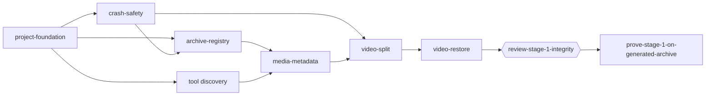

# Stage 1 -- Registry, split and restore

## Goal

Deliver a single `arxgo` executable that builds the CSV file registry, moves video files into a
mirrored video archive with video description files and a video registry, and restores them. No
previews are generated. The stage is safe to run on a multi-terabyte archive: it is crash-safe,
resumable and refuses to start without enough free space.

## Capabilities

| Capability | Page | Summary |
| --- | --- | --- |
| `project-foundation` | [CLI](cli.md) | Operations, flags, defaults, exit codes, logging setup, cross-builds, CI |
| `crash-safety` | [Integrity](integrity.md) | Filesystem primitives, lock, WAL, checkpoints, recovery, preflight, progress |
| `archive-registry` | [Registry](registry.md) | Deterministic traversal, type detection, CSV registry |
| `media-metadata` | [Metadata](metadata.md) | Tool discovery, ISO BMFF parsing, ffprobe JSON |
| `video-split` | [Split and restore](split-restore.md#split) | Move videos, descriptions, video registry, summary |
| `video-restore` | [Split and restore](split-restore.md#restore) | Move videos back, description/preview cleanup, missing directories |

Shared file formats are fixed in [contracts](contracts.md).

## Implementation order

After the CLI contract, filesystem primitives, the walker, type detection and tool discovery are
independent and can be developed in parallel. The exact task graph is in the
[plan](../../impl/plan.md).

## Exit criteria

- `arxgo scan`, `arxgo split` and `arxgo restore` behave as specified on Linux; the Windows build
  cross-compiles and type-checks (runtime checks: [Windows verification](../../guide/windows-verification.md), deferred).
- Crash injection at every transaction step recovers without loss or duplication.
- A split/restore round trip on a generated archive reproduces every path, size and SHA-256.
- The stage checkpoint records `proceed` or `proceed-with-nonblocking-notes`.
- `media-previews` (stage 2) depends only on the contracts in this stage.
- `catia-archive` (stage 4) depends on the contracts in this stage and the sidecar-failure rule
  of stage 2; it does not depend on stage 3.
