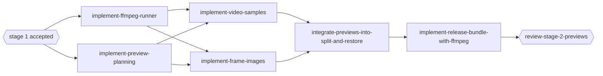

# Stage 2 -- Previews

## Goal

Everything in [stage 1](../stage-1-core/README.md), plus optional short video samples and PNG frame
images generated during `split`, so a person browsing the document archive can see what a moved
video contains without fetching it from the video archive.

## Capabilities

| Capability | Page | Summary |
| --- | --- | --- |
| `media-previews` | [Previews](previews.md) | ffmpeg runner, preview planning, samples, frames, split/restore integration, release bundle |

## Dependency rule

Previews are produced by the external `ffmpeg` executable. The Go standard library and the approved
pure-Go dependencies cannot decode and encode video, so without `ffmpeg` the feature is not
available: requesting `--sample` or `--image` exits 3 with download guidance
([tool discovery](../stage-1-core/metadata.md#tool-discovery)). Stage-1 behavior without these
flags is unchanged and needs no tool.

## Implementation order

## Exit criteria

- Sample and image options produce the specified files for every position mode on generated test
  videos, on a local machine with ffmpeg installed. GitHub CI does not run these live tests.
- Preview failures never fail or roll back the move of the original video.
- Restore honors `--previews`.
- Release archives contain `arxgo` plus pinned ffmpeg/ffprobe builds with checksums and licence
  notices, subject to the human licensing decision.
- `catia-archive` (stage 4) may start; it reuses the sidecar-failure rule and does not wait for
  stage 3.
