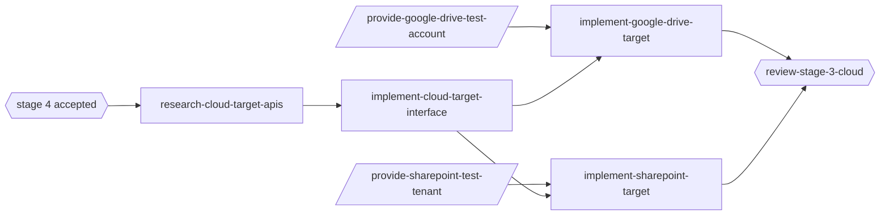

# Stage 3 -- Cloud publishing

## Goal

Everything in [stage 2](../stage-2-previews/README.md), plus publishing the **video** archive to
Google Drive or Microsoft SharePoint and writing the real per-file share links into descriptions
and registries. In stages 1-2, `--base-url` is informational: it only composes link text.

Stage 3 is implemented after [stage 4](../stage-4-catia/README.md). It does not consume CATIA
contracts beyond knowing that `--catia` exists: `split --publish` and `publish` upload only the
video archive. `--catia` together with `--publish` is a usage error (exit 2). The CATIA archive
(`--catia-archive`) is a separate tree and is not uploaded in this stage.

## Capabilities

| Capability | Page | Summary |
| --- | --- | --- |
| `cloud-publishing` | [Cloud targets](cloud-targets.md) | Target interface, Google Drive and SharePoint uploaders, link rewrite, resumable publish |

## Status

This stage is specified at the interface and behavior level so stages 1-2 keep compatible seams
(`url` column, description `url` key, WAL `published` step). Its tasks start with a research task
after the stage-4 checkpoint, and depend on human-provided test tenants and credentials.

## Implementation order

## Exit criteria

- `arxgo split --publish gdrive|sharepoint` uploads videos resumably, records real links, and a
  rerun uploads nothing new.
- `split --catia --publish` is refused before any network call.
- Credentials are never written to logs, registries, descriptions or state files.
- The binary remains a single static executable.
