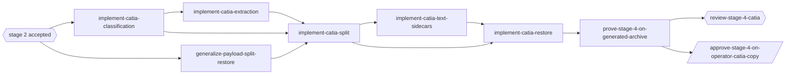

# Stage 4 -- CATIA archive

## Goal

Everything in [stage 1](../stage-1-core/README.md) and the common contracts of
[stage 2](../stage-2-previews/README.md), plus crash-safe split and restore of CATIA CAD files.
The operator moves CATIA files into a separate mirrored CATIA archive (`--catia-archive`) the same
way as video, leaves Markdown descriptions in the document tree, and can optionally extract
accessible text for browsing and search. Stage 4 does not consume [stage 3](../stage-3-cloud/README.md) cloud contracts.

## Capabilities

| Capability | Page | Summary |
| --- | --- | --- |
| `catia-archive` | [CATIA files](catia.md), [Split and restore](split-restore.md) | Classify CATIA files, extract accessible metadata and optional text, move and restore them through the stage-1 pipeline |

## Dependency rule

Stage 4 starts after the [stage 2](../stage-2-previews/README.md) checkpoint is accepted. It reuses
stage-1 scan, lock, WAL, transfer, descriptions and restore, and the stage-2 post-commit sidecar
model (WAL version 2 events, part files, failure without rollback, rerun catch-up). It does not
import `internal/cloud`, does not publish, and does not generate video previews.
[Stage 3](../stage-3-cloud/README.md) starts after this stage's checkpoint.

CATIA extraction is pure Go. There is no CATIA licence, CAA API or external CAD tool. A missing
structured field is an empty result, not a failed move.

## Implementation order

The exact task graph is in the [plan](../../impl/plan.md). The operator trial does not block stage 3.

## Exit criteria

- `arxgo split --catia` and `arxgo restore --catia` behave as specified on Linux; the Windows build
  cross-compiles and type-checks (runtime checks: [Windows verification](../../guide/windows-verification.md), deferred).
- Default `split`/`restore` without `--catia` keep today's video behavior, and the video registry
  never picks up CATIA history.
- A CATIA split/restore round trip on a generated archive reproduces every original path, size and
  SHA-256; descriptions and optional text sidecars follow the contracts.
- Crash injection at transfer and text-sidecar steps recovers without loss or duplication of the
  CATIA original.
- Text extraction failure never rolls back a committed move.
- The stage checkpoint records `proceed` or `proceed-with-nonblocking-notes`.
- `cloud-publishing` (stage 3) depends on this stage's checkpoint and still publishes only the
  video archive.
